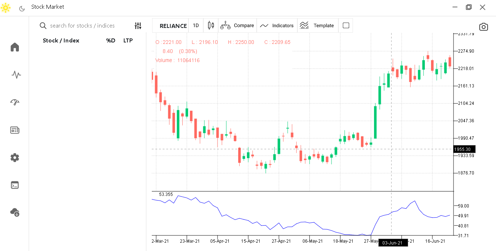

# stockui
 Stock UI is a desktop software written using electron JS framework and uses python for calculating data while web technologies for rendering ui . 

 

## About Stock Analysis Project

The goal of our project is to make a free and open source software for Stock analysis, marketing , strategy development , backtesting and learning about Stock markets.

People who wants to experiment with the various indicators could develp their own strategy and build their portfolio without paying anything.

 Following technologies are used:

 1. python, pandas, numpy for calculation of data for various graphs and indicators
 2. html, css for frontend UI
 3. p5.js for 2d graphics (i.e.  graphs plot and indicators )
 4. SQL for saving and fetching data.

  

 |Directories | Files | Detail | implemented|
 |----------|-------|--------|---|
 |css| bootstrap.min , graph , indicator, main | contains style sheet for ui| Done |
 | graph | graph library , indicator library | contains logic for calculation of indicators and graphs.| Done |
 | icon | svg and png graphics | icons and buttons designed in figma | Done |
 | news | newextractor | get news from internet server | TODO |
 | Script | bootstrap library, All javascripts| Script for drawing graph | Done |
 | |

 * index.js - electron js script for loading browser window and receiving and sending messages from and to different windows and views.

 * index.html - file for rendering main page.

 * preload.js - script that is preloaded by index.html has logic for getting and sending data to python files and sending data to script/receive_data.js .

* package.json - file containing detail for all packages that are installed using npm.

### How to Contribute
___

We welcome contributors from the any of the technologies that has been used by us. This project is being developed by homofabers open source community.

For contribution to this project join our discord server https://discord.gg/4KnV9qZ9

Contribute us by
*  Sharing your ideas for the project.
*  Writting logics in python for more indicators.
* Front-end development in html , css 
* Designing better ui/ux
* logics and strategy development using Javascript and Python .
* data collection by web scrapping and api e.g. newsextractor .
* This project has sub - projects that will be added later on to this 
    * Indicator library - contains 50+ indicators that are continiousally being updated and modified
    * Graph Library - contains all the different type of financial graphs data calculation functions.

* Fork this project and build using
    > `npm build`
* Contact us on discord for more info and  programming technique that has been used by us.